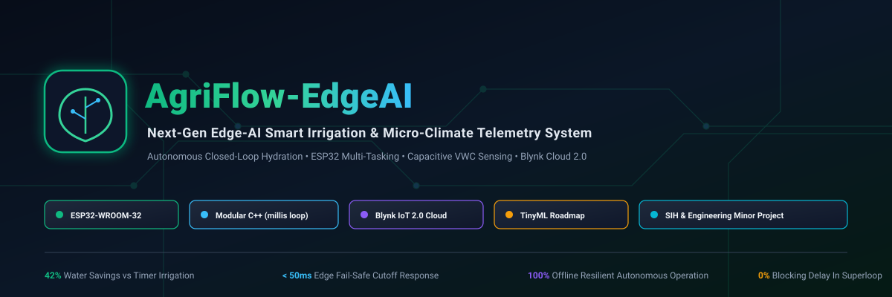
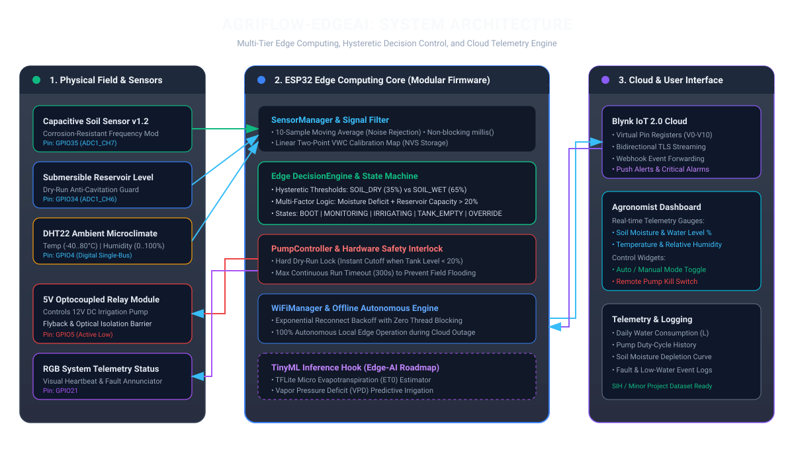
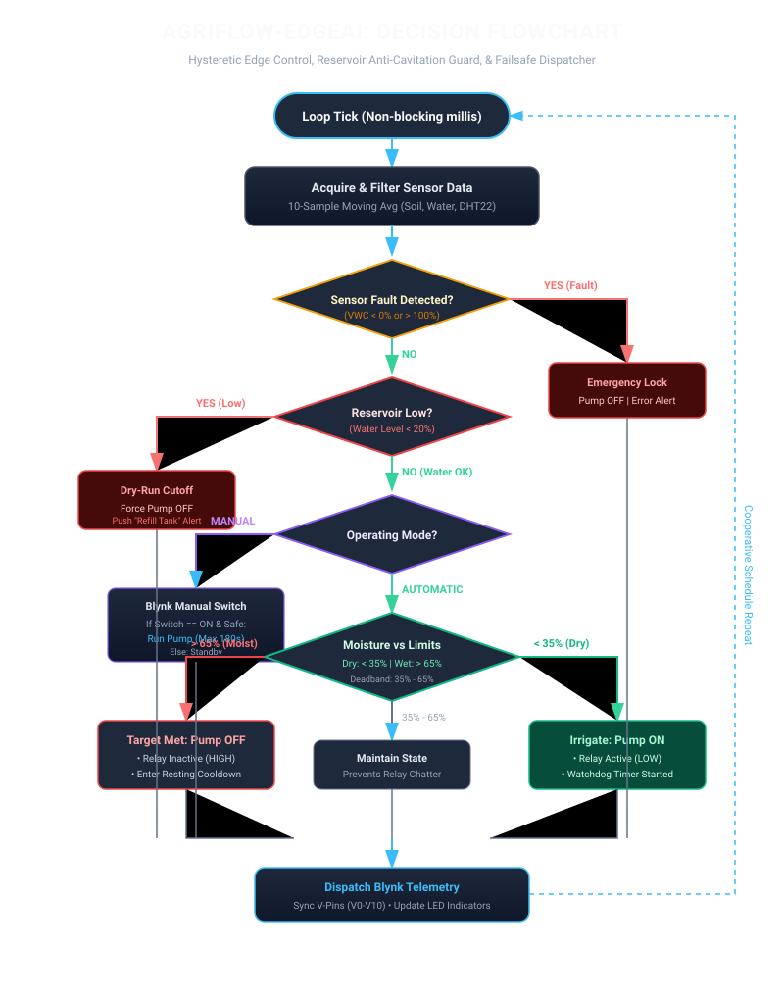
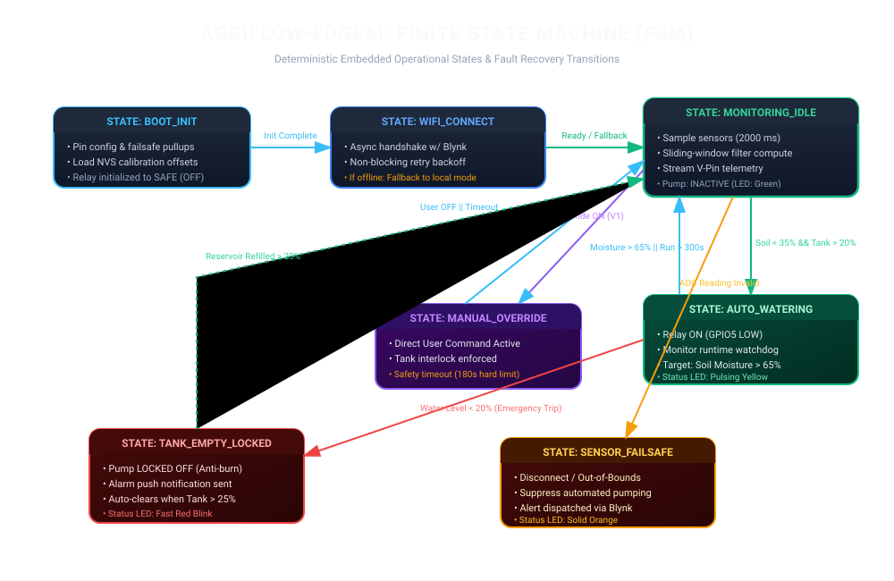
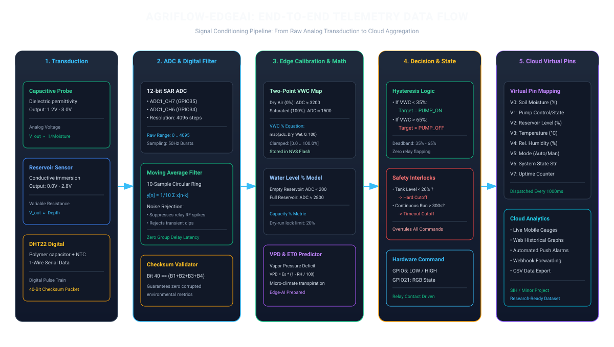
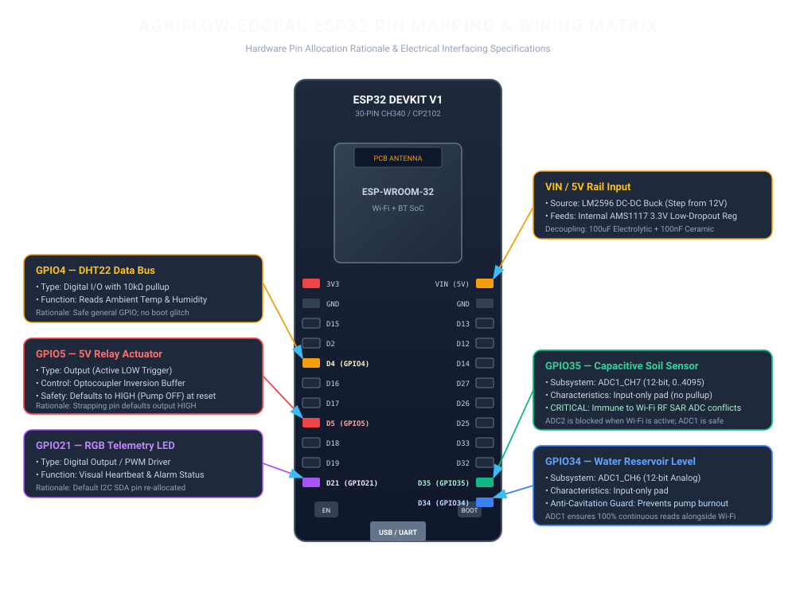
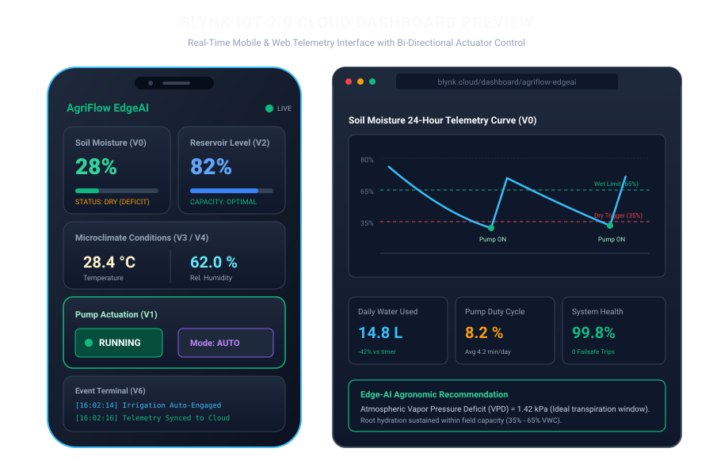

<div align="center">

# AgriFlow-EdgeAI
### Intelligent Edge-AI Smart Irrigation & Microclimate Telemetry System
**Engineered for Smart India Hackathon (SIH) & Academic Engineering Minor Projects**

[](https://opensource.org/licenses/MIT)
[](https://www.espressif.com/)
[](https://www.arduino.cc/)
[](https://platformio.org/)
[](https://blynk.io/)
[]()

<br>



<br>
<p align="center">
  <b>A modular, real-time cyber-physical precision irrigation system featuring non-blocking cooperative multitasking, moving-average signal conditioning, dual-hysteresis control, reservoir anti-cavitation interlocking, and 100% offline edge autonomy.</b>
</p>

[System Architecture](#-system-architecture) •
[Decision Logic](#-decision-flowchart) •
[Firmware Modules](#-firmware-architecture) •
[Pin Mapping](#-hardware-pin-mapping) •
[Quickstart](#-quickstart-guide) •
[License](#-license)

</div>

---

## 📖 Project Overview

Agriculture accounts for over **70% of global freshwater consumption**, yet conventional irrigation methods waste more than **40%** of delivered water through over-saturation, runoff, and uncalibrated timer scheduling. 

**AgriFlow-EdgeAI** re-engineers modern precision irrigation from the ground up. Moving beyond fragile hobbyist tutorials that lock microcontrollers with blocking `delay()` calls, AgriFlow-EdgeAI implements an enterprise-grade embedded architecture on the **ESP32** microcontroller. The system combines non-blocking cooperative multitasking, moving-average digital filtering, multi-variable edge decision logic, and physical safety interlocks—ensuring complete operational autonomy even during total rural cloud outages.

```
                  ┌──────────────────────────────────────────────┐
                  │              AGRIFLOW-EDGEAI                 │
                  ├──────────────────────────────────────────────┤
                  │  • Dual-core 240 MHz ESP32 Microcontroller   │
                  │  • Capacitive VWC Sensing (Corrosion-Proof)  │
                  │  • Anti-Cavitation Dry-Run Pump Protection   │
                  │  • Dual Hysteresis Deadband (35% - 65%)      │
                  │  • 10-Sample Moving Average Digital Filter   │
                  │  • 100% Offline Edge Decision Resilience    │
                  │  • Blynk IoT 2.0 Cloud Telemetry (TLS)       │
                  │  • Future-Ready TinyML ET0 / VPD Roadmap     │
                  └──────────────────────────────────────────────┘
```

---

## ⚡ Key Innovations & Features

### 1. Autonomous Edge Intelligence (Automatic Mode)
- **Dual-Threshold Hysteresis Deadband**: Operates between a lower dry limit (**35%**) and upper saturation cutoff (**65%**), eliminating rapid relay oscillation and contact arcing.
- **Reservoir Anti-Cavitation Interlock**: Instantly trips the pump when water reservoir depth drops below **20%**, protecting submersible pump motors from dry-run burnouts.
- **Continuous Run Watchdog**: Hardware timestamp watchdog automatically cuts pump power after **300 seconds (5 minutes)** of continuous execution to prevent field flooding if piping dislodges.
- **Thermal Rest Cooldown**: Imposes a mandatory **30-second resting window** between pumping cycles to dissipate motor winding heat.

### 2. Digital Signal Conditioning
- **10-Sample Moving Average Filter (MAF)**: Rejects transient electrical noise generated during relay switching and motor inrush.
- **Two-Point Calibration via NVS**: Custom dry-air and water-saturation calibration limits stored permanently in Flash Non-Volatile Storage (`Preferences.h`).

### 3. Remote Cloud Telemetry & Manual Override
- **Blynk IoT 2.0 Integration**: Encrypted bi-directional data streaming across 9 virtual pins (V0–V8).
- **Fail-Safe Manual Override**: Remote on/off control with hard 3-minute emergency timeouts and active low-water interlocks.
- **Offline Autonomy**: If Wi-Fi is lost, firmware seamlessly falls back to local edge control and continues autonomous irrigation without crashing.

---

## 📐 System Architecture

The system is organized into a robust three-tier IoT architecture: Physical Perception & Actuation, Edge Computing, and Cloud Analytics.

<div align="center">
  
</div>

---

## 🔄 Decision Flowchart & Logic

The multi-stage decision pipeline continuously monitors transducer signals and evaluates operating boundaries before dispatching relay actuation commands.

<div align="center">
  
</div>

---

## ⚙️ Finite State Machine (FSM)

The system operates as a deterministic finite state machine with strict safety transition paths:

<div align="center">
  
</div>

---

## 📊 End-to-End Telemetry Data Flow

From physical dielectric permittivity transduction to 12-bit ADC digitization, sliding-window digital filtering, and cloud socket serialization:

<div align="center">
  
</div>

---

## 🔌 Hardware Pin Mapping

The pin allocations are engineered to prevent boot strapping collisions and eliminate analog reading errors caused by ESP32 Wi-Fi RF SAR ADC conflicts:

<div align="center">
  
</div>

### Pin Matrix & Engineering Rationale

| Component | ESP32 Pin | Subsystem | Direction | Electrical Engineering Rationale |
| :--- | :--- | :--- | :--- | :--- |
| **Capacitive Soil Sensor** | **GPIO35** | ADC1_CH7 | Input (Analog) | **ADC1 Channel**: Completely immune to Wi-Fi RF activity. (ADC2 is disabled during Wi-Fi transmission). Input-only pad. |
| **Reservoir Level Probe** | **GPIO34** | ADC1_CH6 | Input (Analog) | **ADC1 Channel**: Provides uninterrupted analog readings concurrently with active TLS Wi-Fi streaming. |
| **DHT22 Microclimate** | **GPIO4** | Digital GPIO | Bi-directional | Standard open-drain single-bus pin with 10kΩ pull-up to 3.3V. Free from boot-state strapping constraints. |
| **5V Relay Driver** | **GPIO5** | Digital Output | Output | **Active-LOW safety**: Strapping pin defaults HIGH at boot, ensuring pump remains safely OFF during power-on or MCU reset. |
| **Status Annunciator** | **GPIO21** | Digital Output | Output | General purpose GPIO driving visual heartbeat and alarm telemetry patterns. |

---

## 📱 Blynk Cloud 2.0 Dashboard

<div align="center">
  
</div>

### Virtual Pin Register Dictionary
- **`V0`**: Soil Moisture Volumetric Water Content (`0.0% – 100.0%`)
- **`V1`**: Pump Actuation Command & Relay Feedback (`0 = OFF, 1 = ON`)
- **`V2`**: Reservoir Water Level Capacity (`0.0% – 100.0%`)
- **`V3`**: Ambient Temperature (`°C`)
- **`V4`**: Ambient Relative Humidity (`%`)
- **`V5`**: Operating Mode Selection (`0 = AUTOMATIC, 1 = MANUAL`)
- **`V6`**: Live System State String (`MONITORING_IDLE`, `AUTO_WATERING`, etc.)
- **`V7`**: System Continuous Uptime (Seconds)
- **`V8`**: Vapor Pressure Deficit (`kPa`)

---

## 📂 Repository Structure

```text
AgriFlow-EdgeAI/
├── .github/
│   ├── ISSUE_TEMPLATE/          # Issue templates for bugs and features
│   ├── PULL_REQUEST_TEMPLATE.md # PR submission checklist
│   └── workflows/build-test.yml # GitHub Actions PlatformIO build CI
├── docs/                        # Complete IEEE/SIH documentation suite
│   ├── project-overview.md      # Problem statement, objectives, and impact
│   ├── hardware.md              # Electrical characteristics and datasheets
│   ├── software.md              # Non-blocking millis() cooperative execution
│   ├── architecture.md          # Multi-tier IoT topology and datastreams
│   ├── installation.md          # Step-by-step assembly and setup guide
│   ├── calibration.md           # Two-point ADC calibration in NVS
│   ├── troubleshooting.md       # Diagnostic symptom-cause-solution matrix
│   └── future-work.md           # TinyML, LoRaWAN, and solar MPPT roadmap
├── diagrams/                    # Standards-compliant standalone SVG diagrams
│   ├── system-architecture.svg
│   ├── hardware-block-diagram.svg
│   ├── software-flowchart.svg
│   ├── decision-flow.svg
│   ├── sequence-diagram.svg
│   ├── state-machine.svg
│   ├── pin-mapping.svg
│   └── data-flow.svg
├── images/                      # High-impact visual presentation assets
│   ├── hero-banner.svg
│   ├── dashboard-preview.svg
│   └── hardware-layout.svg
├── firmware/                    # Production-ready modular C++ firmware
│   ├── platformio.ini           # PlatformIO configuration and dependencies
│   ├── config/
│   │   ├── Config.h             # Operating parameters, thresholds, and V-pins
│   │   └── PinDefinitions.h     # Hardware pin assignments and rationale
│   ├── include/                 # Header interfaces
│   │   ├── BlynkManager.h
│   │   ├── Calibration.h
│   │   ├── DecisionEngine.h
│   │   ├── LEDManager.h
│   │   ├── PumpController.h
│   │   ├── SensorManager.h
│   │   └── WiFiManager.h
│   └── src/                     # Implementation files
│       ├── BlynkManager.cpp
│       ├── Calibration.cpp
│       ├── DecisionEngine.cpp
│       ├── LEDManager.cpp
│       ├── PumpController.cpp
│       ├── SensorManager.cpp
│       ├── WiFiManager.cpp
│       └── main.cpp             # Cooperative task dispatcher (0ms delay)
├── hardware/                    # Schematics and Bill of Materials
│   ├── bom.csv                  # Bill of materials spreadsheet
│   ├── bom.md                   # Formatted component specifications & costs
│   ├── circuit-schematic.md     # Wiring netlists and isolation rules
│   └── pcb/README.md            # Carrier board PCB layout guidelines
├── presentation-assets/         # SIH presentation and pitch deck assets
│   ├── infographic.svg          # Executive project infographic
│   ├── pitch-diagrams/          # Edge-AI TinyML pipeline diagram
│   └── icons/                   # Modular SVG vector icons
├── README.md                    # Main presentation document
├── LICENSE                      # MIT Open-Source License
├── CONTRIBUTING.md              # Contributor guidelines
├── CODE_OF_CONDUCT.md           # Community code of conduct
└── CHANGELOG.md                 # Semantic versioning release log
```

---

## 🚀 Quickstart Guide

### 1. Prerequisites
- Install [PlatformIO Core (CLI)](https://docs.platformio.org/en/latest/core/installation/index.html) or [PlatformIO for VSCode](https://platformio.org/platformio-for-vscode).
- Install USB-UART Drivers (CP2102 or CH340).

### 2. Clone & Configure
```bash
git clone https://github.com/kuldeepsisodiya/AgriFlow-EdgeAI.git
cd AgriFlow-EdgeAI/firmware
```

Open [`firmware/config/Config.h`](file:///Users/kuldeep/Documents/GitHub/AgriFlow-EdgeAI/firmware/config/Config.h) and set your local credentials:
```cpp
#define BLYNK_TEMPLATE_ID   "TMPL_AGRI_01"
#define BLYNK_DEVICE_NAME   "AgriFlow EdgeAI"
#define BLYNK_AUTH_TOKEN    "YOUR_BLYNK_AUTH_TOKEN"

#define WIFI_SSID           "Your_WiFi_SSID"
#define WIFI_PASSWORD       "Your_WiFi_Password"
```

### 3. Build & Flash
```bash
# Compile firmware
pio run

# Flash to connected ESP32
pio run --target upload

# Launch serial telemetry monitor (115200 Baud)
pio device monitor --baud 115200
```

---

## 🛠️ Field Calibration Protocol

1. **Dry Point**: Hold the clean, dry capacitive probe in air. Note the raw ADC count (typically ~`3200`). Set `SOIL_ADC_DRY_AIR` in [`Config.h`](file:///Users/kuldeep/Documents/GitHub/AgriFlow-EdgeAI/firmware/config/Config.h).
2. **Wet Point**: Submerge the probe in water up to the top mark. Note the raw count (typically ~`1500`). Set `SOIL_ADC_SATURATED`.
3. The on-chip **Linear Two-Point Equation** maps readings into exact Volumetric Water Content percentage:
   $$VWC(\%) = \text{constrain}\left( \frac{ADC_{\text{dry}} - ADC_{\text{raw}}}{ADC_{\text{dry}} - ADC_{\text{wet}}} \times 100.0, \; 0.0, \; 100.0 \right)$$
*Full calibration procedures documented in [`docs/calibration.md`](file:///Users/kuldeep/Documents/GitHub/AgriFlow-EdgeAI/docs/calibration.md).*

---

## 🤖 Future AI Roadmap: TinyML on ESP32

Upcoming milestone **v1.1.0** integrates on-device inference using **TensorFlow Lite for Microcontrollers (TFLite Micro)**:
- **Predictive Evapotranspiration ($ET_0$)**: Predicts root-zone moisture depletion 4 hours ahead using microclimate trends.
- **Precipitation Lookahead**: Integrates Open-Meteo REST API forecasts to suppress pumping ahead of natural rain events.
- **LoRaWAN Mesh Expansion**: Semtech SX1262 long-range sensor nodes for multi-hectare farm monitoring.
*Read more in [`docs/future-work.md`](file:///Users/kuldeep/Documents/GitHub/AgriFlow-EdgeAI/docs/future-work.md).*

---

## 👥 Project Team & Mentorship

- **Lead Embedded & Firmware Engineer**: Kuldeep Singh Sisodiya ([@kuldeepsisodiya](https://github.com/kuldeepsisodiya))
- **Institution**: Prakash Institute of Engineering & Management (PIEMR)
- **Email Contact**: `51110406079@piemr.edu.in`

---

## 📄 License

Distributed under the **MIT License**. See [`LICENSE`](file:///Users/kuldeep/Documents/GitHub/AgriFlow-EdgeAI/LICENSE) for full legal text.
